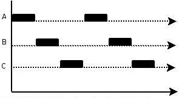
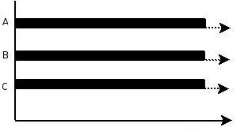
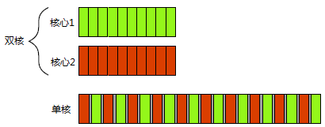

# 一、线程创建与管理

## 1.1 并发

### 1.1.1 并发与并行

**并发：**同一时间段内可以交替处理多个操作，强调同一时段内交替发生。



**并行**：同一时刻内同时处理多个操作，强调同一时刻点同时发生。



### 1.1.2 硬件并发与任务切换 

单片机上的单核处理器支持并发多任务处理，依靠任务切换实现，与多核处理器上的多任务并发处理方式不同。

- 双核处理器并行执行（**硬件并发**）对比单核处理器并发执行（**任务上下文切换**）

  

- 双核处理器均并发执行（一般任务数远大于处理器核心数，多核并发更常见）


### 1.1.3 多线程并发与多进程并发

**任务**

为达到某一目的而进行的一系列操作，在计算机中主要指由软件完成的一个活动；一个任务既可以是一个进程，也可以是一个线程。

> 举例：读取数据并放入内存，可以通过进程实现，也可以通过线程实现。

**进程**

系统中并发执行的单位，资源分配的基本单位，也可能作为调度运行的单位，拥有独立的数据空间和代码空间。

> 举例：用户运行程序，系统即创建一个进程，在为其分配资源后放入就绪队列，当被进程调度程序选中时，为其分配CPU及其他相关资源，该进程开始运行。

**线程**

执行处理器调度的基本单位。一个进程由一个或多个线程构成，各线程共享相同的代码和全局数据，同时也有各自私有的堆栈。

***总结***

进程与线程的区别在于：进程有独立的全局数据，线程存在于进程中，故一个进程的所有线程共享该进程的全局数据。由于线程共享同样的系统区域，所以操作系统分配给一个进程的资源对该进程的所有线程都是可用的。

> 在MAC、Windows NT等采用微内核的操作系统中，进程只作为资源分配的单位，不再是调度运行的单位。在微内核系统中，真正调度运行的基本单位是线程。因此实现并发功能的单位是线程。在Linux系统中，线程只作为特殊的进程存在，二者不做过多区分。
>
> 多进程并发与多线程并发的区别主要在于有没有共享数据：多进程间的通信较复杂且代价较大，常见的进程间通信方式有管道、信号、文件、套接字等（C++未提供进程间通信的原生支持）；多线程本身共享进程的全局数据。

## 1.2 如何使用并发

### 1.2.1 为什么使用并发

程序使用并发的原因有两种：关注点分离和提高性能。

**关注点分离**

通过将相关的代码放在一起并与无关的代码分开，可以使程序更容易理解和测试，从而减少出错的可能性。使用并发可以分隔不同的功能区域，程序中不同的功能，使用不同的线程去执行。当为了分离关注点而使用多线程时，设计线程的数量的依据，不再是依赖于CPU中的可用内核的数量，而是依据概念上的设计（依据功能的划分）。

**提高性能**

为了充分发挥多核心处理器的优势，使用并发将单个任务分成几部分且各自并行运行，从而降低总运行时间。根据任务分割方式的不同，又可以将其分为两大类：一类是对同样的数据应用不同的处理算法（任务并行）；另一类是用同样的处理算法共同处理数据的几部分（数据并行）。

> 运行越多的线程，操作系统需要为每个线程分配独立的栈空间，需要越多的上下文切换，这会消耗很多操作系统资源，如果在线程上的任务完成得很快，那么实际执行任务的时间要比启动线程的时间小很多，所以在某些时候，增加一个额外的线程实际上会降低，而非提高应用程序的整体性能，此时收益比不上成本。

### 1.2.2 在C++中使用并发和多线程

C++11标准中引入了多线程，提供语言级别的多线程原生支持；在此之前需要借助编译器厂商提供的平台相关的扩展多线程API来实现并发编程。

## 1.3 C++线程创建

函数并发运行时需要确保共享数据的并发访问是安全的。

### 1.3.1 C++11标准多线程支持库

| 多线程库           | 功能                                                         |
| ------------------ | ------------------------------------------------------------ |
| thread             | 提供线程创建及管理的函数或类接口                             |
| mutex              | 为线程提供获得独占式资源访问能力的互斥算法，保证多个线程对共享资源的同步访问 |
| condition_variable | 允许一定量的线程等待（可以定时）被另一线程唤醒，然后再继续执行 |
| future             | 提供了一些工具来获取异步任务（即在单独的线程中启动的函数）的返回值，并捕捉其所抛出的异常 |
| atomic             | 为细粒度的原子操作（不能被处理器拆分处理的操作）提供组件，允许无锁并发编程 |

### 1.3.2 线程创建示例

线程创建和管理的函数或类主要由< thread >库文件来提供，该库文件的主要操作如下：

| 操作              | 效果                                                         |
| ----------------- | ------------------------------------------------------------ |
| thread t          | 默认构造函数，构造不表示线程的 `thread` 对象（nonjoinable）  |
| thread t(f, ...)  | 构造新的 `std::thread` 对象并将它与执行线程关联，f可调用对象将被启动于一个线程中 或 抛出 ```std::system_error``` |
| thread t(rv)      | 移动构造函数，构造表示曾为 `rv` 所表示的执行线程的 `thread` 对象。此调用后 `other` 不再表示执行线程（nonjoinable） |
| t.~thread()       | 销毁*this，若t是joinable则调用```std::terminate()```         |
| t = rv            | 移动赋值，将rv状态移动赋值到t，若t是joinable则调用std::terminate() |
| t.joinable        | 检查 t 是否有一个关联线程（joinable），若是则返回true。      |
| t.join()          | 等待关联线程完成工作（joinable），然后令t变成nonjoinable；若t不是joinable则抛出std::system_error |
| t.detach()        | 解除t与线程的关联（joinable）并让线程继续运行，然后令t变成nonjoinable；若t不是joinable便抛出std::system_error |
| t.get_id()        | 返回std::thread::id（t的唯一标识符）                         |
| t.native_handle() | 返回依赖于平台的类型native_handle_type，用于不具可移植性的扩展 |

通过```std::thread t(f, args…)```创建线程，可以给线程函数传递参数。通过```join()```函数关联并阻塞线程，等待该线程执行完毕后继续；通过```detach()```函数解除关联使线程可以与主线程并发执行，但若主线程执行完毕退出后，```detach()```解除关联的线程即便没有执行完毕，也将自动退出（避免此类情况发生）。

***说明：***

复制构造函数被删除，`thread` 不可复制，即不存在两个 `std::thread` 对象表示同一执行线程。移动或按值复制线程函数的参数，若需要传递引用参数给线程函数，则必须使用 std::ref 或 std::cref 包装。

***示例***：

```c++
/*
    文件：thread1.cpp
    功能：创建线程，并观察线程的并发执行与阻塞等待

    编译：g++ -Wall -g -std=c++11 -pthread thread1.cpp -o thread1		
*/
  
#include <iostream>
#include <thread>
#include <chrono>
 
// 可调用对象：函数
void thread_function(int n)
{
    // 获取线程ID
    std::thread::id this_id = std::this_thread::get_id();			

    for(int i = 0; i < 5; i++){    
        std::cout << "Child function thread " << this_id<< " running : " << i+1 << std::endl;
        // 进程睡眠n秒
        std::this_thread::sleep_for(std::chrono::seconds(n));   	
    }
}

// 可调用对象：仿函数
class Thread_functor
{
public:
    void operator()(int n)
    {
        std::thread::id this_id = std::this_thread::get_id();

        for(int i = 0; i < 5; i++){
            std::cout << "Child functor thread " << this_id << " running: " << i+1 << std::endl;
            std::this_thread::sleep_for(std::chrono::seconds(n));   
        }
    }	
};
 
int main()
{
    // 通过 可调用对象-函数 构造。
    std::thread mythread1(thread_function, 1);
    // 判断是否mythread1是否关联线程
    if(mythread1.joinable())
    {
        // 合并线程：阻塞主线程等待mythread1关联的线程完成工作。
        mythread1.join(); 
    }
    
    // 通过 可调用对象-仿函数 构造。
    Thread_functor thread_functor;
    std::thread mythread2(thread_functor, 3);
    if(mythread2.joinable())
    {
        // 分离线程：使子线程和主线程并行运行，主线程不再等待子线程。
        mythread2.detach();
    }                         

    // 可调用对象：Lambda表达式
    auto thread_lambda = [](int n){
        std::thread::id this_id = std::this_thread::get_id();
        for(int i = 0; i < 5; i++)
        {
            std::cout << "Child lambda thread " << this_id << " running: " << i+1 << std::endl;
            std::this_thread::sleep_for(std::chrono::seconds(n));   
        }       
    };

    // 通过 可调用对象-Lambda表达式 构造。
    std::thread mythread3(thread_lambda, 4);     
    if(mythread3.joinable())
    {
        mythread3.join();
    }

    // 获取主线程ID
    std::thread::id this_id = std::this_thread::get_id();
    for(int i = 0; i < 5; i++){
        std::cout << "Main thread " << this_id << " running: " << i+1 << std::endl;
        std::this_thread::sleep_for(std::chrono::seconds(1));
    }
#ifdef WIN32
    system("pause");
#endif
    return 0;
}
```

线程创建的参数是函数对象，包括函数指针、成员函数指针、仿函数及lambda表达式。以上示例分别用三种函数对象创建了三个线程，其中第一个线程mythread1阻塞等待其执行完后继续往下执行，第二个线程mythread2不阻塞等待在后台与后面的第三个线程mythread3并发执行，第三个线程继续阻塞等待其完成后再继续往下执行主线程任务。为了便于观察并发过程，对三个线程均用了睡眠延时```this_thread::sleep_for(duration)```函数。

***补充***：

针对任何线程（包括主线程），< thread > 声明了命名空间std::this_thread，用以提高线程专属的全局函数。函数声明和效果见下表：

| 操作                         | 效果                                         |
| ---------------------------- | -------------------------------------------- |
| this_thread::get_id()        | 获取当前线程的ID                             |
| this_thread::sleep_for(dur)  | 将某个线程阻塞dur时间段                      |
| this_thread::sleep_until(tp) | 将某个线程阻塞到tp时间点                     |
| this_thread::yield()         | 建议释放控制以便重新调度使下一个线程能够执行 |

