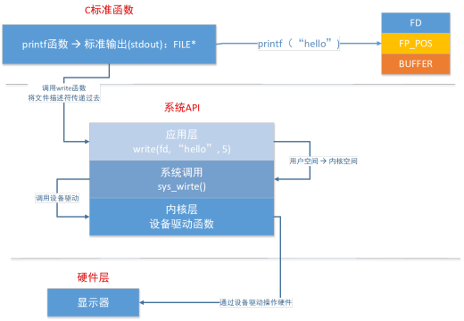
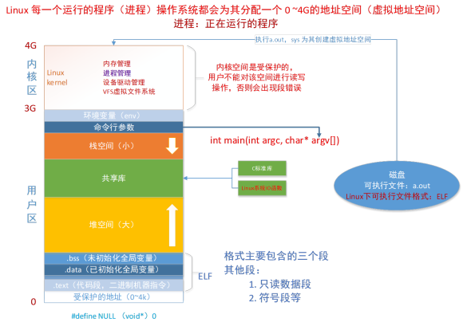

# 一、文件IO相关概念

## 01 C库IO函数的工作流程

用户程序 ==> C标准I/O ==> 内核 ==> 磁盘

使用 fopen()函数 打开一个文件，返回一个 FILE* fp 指针，其成员如下：

- 文件描述符：通过文件描述符找到文件的 inode ，通过 inode 访问对应的数据块。
- 文件指针：读与写操作共享文件指针。
- 文件缓冲区：读或写通过文件缓冲区进行，减少磁盘读写次数，提高效率。

## 02 C库函数与系统函数的关系

以 printf函数 为例：



 系统调用：由OS实现并提供给外部应用程序的编程接口（API），用于应用程序与系统交互。

## 03 虚拟地址空间



内核区受保护，不允许用户读写。

## 04 PCB和文件描述符表


**PCB**

本质为结构体，PCB中有文件描述符表, 文件描述符表中存放着打开的文件描述符。

**文件描述符**

每个进程都有一个属于自己的文件描述符表。

进程启动，默认有3个文件描述符：

```c
#define  STDIN_FILENO	0
#define  STDOUT_FILENO	1
#define  STDERR_FILENO  2
```

# 二、文件读写函数

## open函数

函数功能：打开或新建文件

函数原型：

```c
#include <sys/types.h>
#include <sys/stat.h>
#include <fcntl.h>

int open(const char *pathname, int flags);
int open(const char *pathname, int flags, mode_t mode);
```

函数参数：

- flags

  ```c
  O_RDONLY：只读
  O_WRONLY：只写
  O_RDWR：可读可写
  O_APPEND：末尾追加内容（而非覆盖）
  O_CREAT：若文件不存在则新建。
  O_TRUNC：若文件存在则清空内容。
  O_NONBLOCK：设备文件以非阻塞方式打开。
  O_EXCL：要创建的文件存在时报错。 
  ```

函数返回值：

- 成功：返回文件描述符。
- 失败：返回-1，并设置 errno 值。

------

## close函数

函数功能：关闭文件

函数原型：

```c
int close(int fd);
```

函数参数：

- fd：文件描述符

函数返回值：

- 成功：返回0。
- 失败：返回-1，并设置 errno 值。

------

## read函数

函数功能：从打开的设备或文件中读取数据。
函数原型:

```c
ssize_t read(int fd, void *buf, size_t count);
```

函数参数：

- fd：文件描述符。
- buf：读入的数据保存在缓冲区buf中。
- count：buf缓冲区存放的最大字节数。

函数返回值:

- 大于0：读取到的字节数。
- 等于0：文件读取完毕。
- 等于-1： 出错，并设置errno。

------

## write函数

函数功能：从打开的设备或文件中读取数据。
函数原型:

```c
ssize_t write(int fd, const void *buf, size_t count);
```

函数参数：

- fd：文件描述符。
- buf：写入的数据保存在缓冲区buf中。
- count：buf缓冲区存放的最大字节数。

函数返回值:

- 成功：返回写入的字节数。
- 失败：返回-1并设置errno。

------

## lseek函数

函数功能：更改文件偏移量（cfo，文件开始处到到当前位置的字节数，文件打开时为0，读写操作使cfo增大）。
函数原型:

```c
off_t lseek(int fd, off_t offset, int whence);
```

函数参数：

- fd：文件描述符。
- offset：自定义偏移量（可正可负），具体取决于参数 whence 。
- whence：
  - SEEK_SET：文件偏移量为 offset。
  - SEEK_CUR：文件偏移量为 cfo + offset。
  - SEEK_END：文件偏移量为 文件长度 + offset。

函数返回值:

- 成功：返回新的偏移量。

------

## perror与errno

当系统调用后若出错会将errno全局变量进行设置，perror可以将errno对应的描述信息打印出来。

如：perror("open");  如果报错的话打印：open:(空格)错误信息。

------

## 测试程序

```c
//IO函数测试：open()、close()、read()、write()、lseek()
#include <stdio.h>
#include <stdlib.h>

// memset()
#include <string.h>

#include <sys/types.h>
#include <sys/stat.h>

// lseek()、close()、read()、write()
#include <unistd.h>
// open()
#include <fcntl.h>

int main(int argc, char *argv[])
{
	char read_buf[1024];

	int fd = open(argv[1], O_RDWR | O_CREAT | O_APPEND, 0777);
	if(fd<0)
	{
		perror("open error");
		return -1;
	}

	//ssize_t write(int fd, const void *buf, size_t count);
	write(fd, " Hakuno", strlen(" Hakuno"));

	lseek(fd, 0, SEEK_SET);

	//ssize_t read(int fd, void *buf, size_t count);

	memset(read_buf, 0x00, sizeof(read_buf));

	int n = read(fd, read_buf, sizeof(read_buf));
	printf("n==[%d], buf==[%s]\n", n, read_buf);

	close(fd);

	return 0;
}
```

# 三、文件属性获取函数

## stat/lstat函数

函数功能：获取文件属性。
函数原型:

```c
int stat (const char *pathname, struct stat *buf);
int lstat (const char *pathname, struct stat *buf);
// 区别：对于连接文件，lstat获取链接文件本身的属性信息，stat获取链接指向的文件信息。
```

函数参数：

- 输入参数 pathname ：文件名。

- 输出参数 stat ：获取到的文件属性信息。

  ```c
  struct stat
  {
  	__dev_t st_dev;		// 文件的设备编号
      __ino_t st_ino;		// 节点
      __mode_t st_mode;	// 文件类型与读写权限
      __nlink_t st_nlink;	// 连接到该文件的硬链接数目：新建文件默认为1。
      __uid_t st_uid;		// 用户ID
      __gid_t st_gid;		// 组ID
      __dev_t st_rdev;	// 若目标是设备文件：此项为设备类型。
      __off_t st_size;	// 文件字节数（文件大小）
      __blksize_t st_blksize;	// 块大小（文件系统的I/O缓冲区大小）
      __blkcnt_t st_blocks;		// 块数
      __time_t st_atime;			// 最后访问时间
      __time_t st_mtime;			// 最后修改时间
      __time_t st_ctime;			// 最后改变（属性）时间
  };
  ```

- 结构体 stat 中的 st_mode：

  ```
  // 【st_mode：16位整数】
  //  -------------------------
  //  0-2 bit -- 其他人权限
  //  -------------------------
      S_IROTH      00004  读权限
      S_IWOTH      00002  写权限
      S_IXOTH      00001  执行权限
      S_IRWXO      00007  掩码, 过滤 st_mode中除其他人权限以外的信息
  //  -------------------------
  //  3-5 bit -- 所属组权限
  //  -------------------------
      S_IRGRP     00040  读权限
      S_IWGRP     00020  写权限
      S_IXGRP     00010  执行权限
      S_IRWXG     00070  掩码, 过滤 st_mode中除所属组权限以外的信息
  //  -------------------------
  //  6-8 bit -- 文件所有者权限
  //  -------------------------
      S_IRUSR     00400    读权限
      S_IWUSR     00200    写权限
      S_IXUSR     00100    执行权限
      S_IRWXU     00700    掩码, 过滤 st_mode中除文件所有者权限以外的信息
      If (st_mode & S_IRUSR)   -----为真表明可读
      If (st_mode & S_IWUSR)   -----为真表明可写
      If (st_mode & S_IXUSR)   -----为真表明可执行
  //  -------------------------
  //  12-15 bit -- 文件类型
  //  -------------------------
      S_IFSOCK	0140000 套接字
      S_IFLNK		0120000 符号链接（软链接）
      S_IFREG		0100000 普通文件
      S_IFBLK		0060000 块设备
      S_IFDIR		0040000 目录
      S_IFCHR		0020000 字符设备
      S_IFIFO		0010000 管道
      S_IFMT		0170000 掩码,过滤 st_mode中除文件类型以外的信息
      if ((st_mode & S_IFMT)==S_IFREG) 	-----为真普通文件
      if (S_ISREG(st_mode))   				-----为真表示普通文件
      if (S_ISDIR(st.st_mode))  			-----为真表示目录文件
  ```

函数返回值:

- 成功：0。
- 失败：-1。

## 测试程序

```c
// stat函数测试：获取文件大小、文件所有者、文件所有者所属组、文件类型与权限。
#include <stdio.h>
#include <stdlib.h>
#include <string.h>
#include <sys/types.h>
#include <sys/stat.h>
#include <unistd.h>
#include <fcntl.h>

int main(int argc, char *argv[])
{
    // int stat (const char *pathname, struct stat *buf);
    // int lstat (const char *pathname, struct stat *buf);
    // 区别：对于连接文件，lstat获取链接文件本身的属性信息，stat获取链接指向的文件信息。
    struct stat sb;
    // 获取文件属性
    printf("== 文件名称：%s\n", argv[1]);
    stat(argv[1], &sb);

    printf("== 文件大小：%d\n", sb.st_size);
    printf("== 文件属主：%d\n", sb.st_uid);
    printf("== 文件属组：%d\n", sb.st_gid);

    // 获取文件类型
    printf("== 文件类型：");
    if (S_ISREG(sb.st_mode))
    {
        printf("普通文件。\n");
    }
    else if (S_ISDIR(sb.st_mode))
    {
        printf("目录文件。\n");
    }
    else if (S_ISLNK(sb.st_mode))
    {
        printf("链接文件。\n");
    }

    // 判断文件权限
    printf("== 文件权限：");
    if (sb.st_mode & S_IROTH)
    {
        printf("R ");
    }

    if (sb.st_mode & S_IWOTH)
    {
        printf("W ");
    }

    if (sb.st_mode & S_IXOTH)
    {
        printf("X ");
    }
    
    printf("\n");

    return 0;
}
```

# 四、目录操作相关函数

## opendir函数

函数功能：打开目录。
函数原型:

```c
DIR *opendir (const char *__name);
```

函数参数：

- __name：目录（绝对路径 / 相对路径）。

函数返回值：指向目录的指针。

## readdir函数

函数功能：读取目录内容（目录项）。
函数原型：

```c
struct dirent *readdir (DIR *__dirp)
```

函数参数：

- __dirp：opendir()函数的返回值。

函数返回值：读取的目录项指针。

- struct dirent：

  ```c
  struct dirent
    {
      __ino_t d_ino;					// 目录进入点的inode
      __off_t d_off;					// 目录文件开头至进入点的位移
      unsigned short int d_reclen;	// d_name的长度，不包含NULL字符
      unsigned char d_type;			// d_name 所指的文件类型
      char d_name[256];				// 文件名 
    };
  /* d_byte 的取值 */
  // ==> DT_BLK - 块设备
  // ==> DT_CHR - 字符设备
  // ==> DT_DIR - 目录
  // ==> DT_LNK - 软连接
  // ==> DT_FIFO - 管道
  // ==> DT_REG - 普通文件
  // ==> DT_SOCK - 套接字
  // ==> DT_UNKNOWN - 未知
  ```

## closedir函数

函数功能：关闭目录。
函数原型:

```c
int closedir (DIR *__dirp);
```

函数参数：

- __dirp：opendir()函数的返回值。

函数返回值：

- 成功：0。
- 失败：-1。

> 读取目录内容的一般步骤
>
> 1. DIR *pDir = opendir(“dir”);  			// 打开目录
>
> 2. while((p=readdir(pDir))!=NULL){}  // 循环读取文件
>
> 3. closedir(pDir);                                  //关闭目录

## 测试程序

```c
#include <stdio.h>
#include <stdlib.h>
#include <unistd.h>
#include <sys/types.h>
#include <string.h>
#include <dirent.h>

int main(int argc, char *argv[])
{
    struct dirent *pDent = NULL;

    // DIR *opendir (const char *__name);
    DIR *pDir = opendir(argv[1]);
    if (pDir == NULL)
    {
        perror("opendir error");
        return -1;
    }

    while ((pDent = readdir(pDir)) != NULL)
    {
        if (strcmp(pDent->d_name, ".") == 0 || strcmp(pDent->d_name, "..") == 0)
        {
            continue;
        }

        printf("[%s]====>", pDent->d_name);

        switch (pDent->d_type)
        {
            case DT_REG:
                printf("普通文件");
                break;
            case DT_DIR:
                printf("目录文件");
                break;
            case DT_LNK:
                printf("链接文件");
                break;
            default:
                printf("未知文件");
        }
        printf("\n");
    }

    closedir(pDir);
    
    return 0;
}
```

# 五、文件描述符操作函数

## dup函数

函数功能：复制文件描述符。
函数原型:

```c
int dup (int __fd);
```

函数参数：

- __fd：要复制的文件描述符。

函数返回值：

- 成功：新的文件描述符（与原文件描述符指向同一个文件）。
- 失败：-1。

## dup2函数

函数功能：复制文件描述符（原文件描述符赋值给目标文件描述符）。
函数原型:

```c
int dup2 (int __fd, int __fd2);
```

函数参数：

- __fd：原文件描述符。
- __fd2：目标文件描述符。

函数返回值：

- 成功：目标文件描述符。
- 失败：-1。

## 测试程序

```c
// dup函数测试
#include <stdio.h>
#include <stdlib.h>
#include <string.h>
#include <sys/stat.h>
#include <sys/types.h>
#include <unistd.h>
#include <fcntl.h>

int main()
{
    // open
    const char *fileName = "test.txt";
    int old_fd = open(fileName, O_RDWR|O_APPEND);
    if(old_fd < 0)
    {
        perror("open error");
        return -1;
    }

    // dup()
    int new_fd = dup(old_fd);
    printf("old_fd = %d\n", old_fd);
    printf("new_fd = %d\n", new_fd);

    // write()
    write(new_fd, " function: dup() ", strlen(" function: dup() "));

    // read()
    lseek(old_fd, 0, SEEK_SET); 
    char buf[1024];
    memset(buf, 0x00, sizeof(buf));
    int n = read(new_fd, buf, sizeof(buf));
    printf("read over: n = [%d], buf = [%s]\n", n, buf);

    // close
    close(old_fd);
    close(new_fd);
    
    return 0;
}

// dup2函数测试
#include <stdio.h>
#include <stdlib.h>
#include <string.h>
#include <sys/stat.h>
#include <sys/types.h>
#include <unistd.h>
#include <fcntl.h>

int main(int argc, char *argv[])
{
    // open
    const char *fileName_1 = "test.txt";
    int fd_1 = open(fileName_1, O_RDWR|O_APPEND);
    if(fd_1 < 0)
    {
        perror("open error");
        return -1;
    }

    const char *fileName_2 = "test_1.txt";
    int fd_2 = open(fileName_2, O_RDWR|O_APPEND);
    if(fd_2 < 0)
    {
        perror("open error");
        return -1;
    }

    // dup2
    dup2(fd_1, fd_2);
    printf("fd_1 = %d\n", fd_1);
    printf("fd_2 = %d\n", fd_2);

    // write()
    write(fd_2, " function: dup2() ", strlen(" function: dup2() "));

    // read()
    lseek(fd_2, 0, SEEK_SET); 
    char buf[1024];
    memset(buf, 0x00, sizeof(buf));
    int n = read(fd_2, buf, sizeof(buf));
    printf("read over: n = [%d], buf = [%s]\n", n, buf);

    // close
    close(fd_2);
    close(fd_1);

    return 0;
}
```

# 六、文件读写属性更改函数

## fcntl函数

函数功能：更改已打开的文件的属性。
函数原型:

```c
int fcntl (int __fd, int __cmd, ...);
```

函数参数：

- __fd：文件描述符。
- __cmd：
  - F_DUPFD：复制文件描述符，同dup。
  - F_GETFL：获取文件描述符的 flag 属性值。
  - F_SETFL：设置文件描述符的 flag 属性值。

函数返回值：

- 成功：
  - cmd为 F_DUPFD：返回文件描述符。
  - cmd为 F_GETFL：返回文件描述符的 flags 值。
  - cmd为 F_SETFL：返回 0 。
- 失败：-1。

## 测试程序

```c
// fcntl函数测试
#include <stdio.h>
#include <stdlib.h>
#include <string.h>
#include <sys/stat.h>
#include <sys/types.h>
#include <unistd.h>
#include <fcntl.h>

int main(int argc, char *argv[])
{
    int fd = open(argv[1], O_RDWR);
    if (fd < 0)
    {
        perror("open error");
        return -1;
    }
    
    int flags = fcntl(fd, F_GETFL, 0);
    flags = flags|O_APPEND;
    fcntl(fd, F_SETFL, flags);

    write(fd, " function: fcntl() ", strlen(" function: fcntl() "));

    return 0;
}
```


