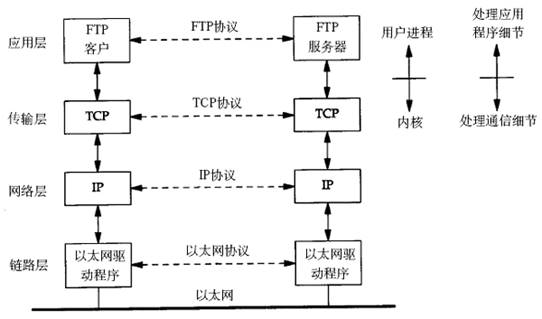
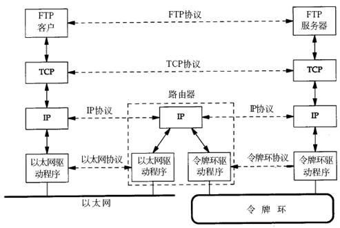
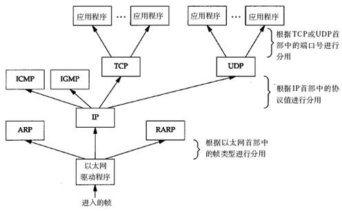
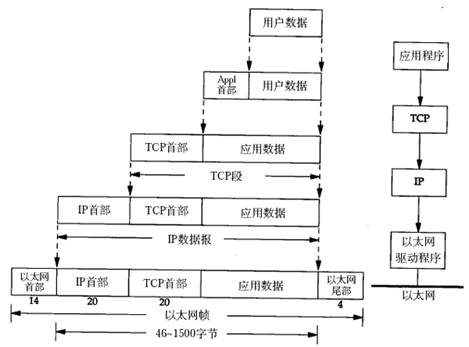
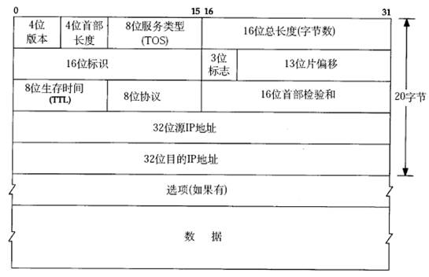

# 一、分层模型

## 01 OSI七层模型

​           

*物理层*：定义物理设备标准，传输比特流（数模转换）；**数据以比特为单位。**

*数据链路层*：格式化**数据以帧为单位**进行传输，控制对物理介质的访问，提供错误检测与纠正确保数据可靠传输。 

*网络层*：在位于不同地理位置的网络中的两个主机系统之间提供连接和路径选择。

*传输层*：定义传输数据的协议与端口号，从下层接受数据分段传输，到达目的地址后重组；**数据以段为单位。**

*会话层*：通过传输层建立数据传输的通路，在系统之间发起会话或接受会话请求。

*表示层*：确保一个系统的应用层发送的信息可被另一个系统的应用层读取，即使用通格式实现多种格式转换。

*应用层*：为用户的应用程序提供网络服务。

## 02 TCP/IP四层模型

TCP/IP网络协议栈分为应用层（Application）、传输层（Transport）、网络层（Network）和链路层（Link）四层。

​           

# 二、协议

## 01 协议定义

协议是通信双方达成的相互遵守的规则；从应用角度来看，协议是数据传输和数据解释的规则。

> TCP协议注重数据的传输，http协议着重于数据的解释。

## 02 典型协议

应用层：常见的协议有HTTP协议、FTP协议。

> HTTP协议：超文本传输协议（互联网应用最为广泛）。
>
> FTP协议：文件传输协议。

传输层：常见协议有TCP/UDP协议。

> TCP协议：传输控制协议，面向连接的、可靠的、基于字节流的传输层控制协议。
>
> UDP协议：用户数据包协议，OSI模型中无连接的传输层协议，提供面向事务的简单不可靠信息传送服务。

网络层：常见协议有IP协议、ICMP协议、IGMP协议。

> IP协议：因特网互联协议。
>
> ICMP协议：Internet控制报文协议，TCP/IP协议族的子协议，用于在IP主机、路由器之间传递控制消息。
>
> IGMP协议：Internet组管理协议，因特网协议家族中的一个组播协议，运行在主机和组播路由器之间。

网络接口层：常见协议有ARP协议、RARP协议。

> ARP协议：正向地址解析协议，通过已知IP寻找对应主机的MAC地址。
>
> RARP协议：反向地址转换协议，通过MAC地址确定IP地址。

# 三、网络应用程序设计模式

## 01 C/S模式

传统的网络应用设计模式，客户机（Client）/ 服务器（Server）模式：需要在通讯两端各自部署客户机和服务器来完成数据通信。

**优点**

- 客户端位于目标主机，保证性能。

- 数据缓存到客户端本地，提高数据传输效率。

**缺点**

- 同时开发服务端与客户端，工作量大，开发周期长。
- 客户端对目标主机安全性构成威胁（用户角度）。

## 02 B/S模式

浏览器（Browser）/ 服务器（Server）模式：在一端部署服务器，另外一端使用每台PC都默认配置的浏览器即可完成数据的传输。

**优点**

- 仅开发服务端，开发量小。
- 使用浏览器展示数据，移植性好，不受平台限制。
- 可自由选择通信协议（或裁剪及定制标准协议）。

**缺点**

- 使用第三方浏览器，网络应用支持受限。
- 数据缓存与传输受到限制。
- 必须采用标准http协议通信，协议选择不灵活。

# 四、通信过程

## 01 主机通讯（TCP/IP协议）过程（同一网段）

​           

## 02 主机通讯（TCP/IP协议）过程（不同网段）

​           

**链路层**规定以太网、令牌环网等标准，并负责网卡设备的驱动、帧同步、冲突检测、数据差错校验等工作。

> 交换机工作在链路层，在不同的链路层网络之间转发数据帧，由于不同链路层的帧格式不同，交换机要将进来的数据包拆掉链路层首部重新封装之后再转发。

**网络层**的IP协议是构成Internet的基础，Internet上的主机通过IP地址来标识，并有大量路由器负责根据IP地址选择合适的路径转发数据包，数据包从源主机到目的主机往往要经过十多个路由器。

> 路由器工作在网络层，同时兼有交换机的功能，可在不同的链路层接口之间转发数据包，因此路由器需要将进入的数据包拆掉网络层和链路层两层首部并重新封装。IP协议不保证传输的可靠性，数据包在传输过程中可能丢失，可靠性可在上层协议或应用程序中提供支持。
>
> 网络层负责点到点（ptop，point-to-point）的传输（“点”指主机或路由器）

**传输层**可选择TCP或UDP协议。

> TCP是一种面向连接的、可靠的协议，即TCP传输的双方需要首先建立连接，之后由TCP协议保证数据收发的可靠性，丢失的数据包自动重发，上层应用程序收到的总是可靠的数据流，通讯之后关闭连接。UDP是无连接的传输协议，不保证可靠性（是否送达与送达顺序）；使用UDP协议的应用程序需要自己完成丢包重发、消息排序等工作。
>
> 传输层负责端到端（etoe，end-to-end）的传输（“端”指源主机和目的主机）。

## 03 主机通信数据流向


**目的主机接收到数据包后，如何经过各层协议到达应用程序：**

​           

以太网驱动程序确定数据帧的有效载荷是何种协议的数据报（根据以太网首部中的“上层协议”字段）

- IP协议数据报：确定数据报有效载荷（根据IP首部中的“上层协议”字段）
  - TCP协议：根据TCP首部的“端口号”字段确定将数据交由哪个进程。
  - UDP协议：根据UDP首部的“端口号”字段确定将数据交由哪个进程。
  - ICMP协议：
  - IGMP协议：
- ARP协议：
- RARP协议：

> 有效载荷（payload）：指除去协议首部之外实际传输的数据。
>
> IP标识网络中不同主机的地址，端口号标识同一主机上不同进程的地址；结合以标识网络中唯一的进程。
>
> IP、ARP和RARP数据报都需以太网驱动程序来封装成帧，但是从功能上划分，ARP和RARP属于链路层，IP属于网络层。
>
> ICMP、IGMP、TCP、UDP的数据都需要IP协议来封装成数据报，但是从功能上划分，ICMP、IGMP与IP同属于网络层，TCP和UDP属于传输层。

# 五、协议格式

## 01 数据包封装

应用层数据通过协议栈发到网络，每层协议都添加数据首部（header）进行封装；到达目的主机后再剥离每层协议的首部，获取应用层数据并交由应用程序处理。

​           

> 各个协议层对数据包称谓不同，在传输层为段（segment），在网络层为数据报（datagram），在链路层为帧（frame）。

## 02 以太网帧格式

​           

目的地址、源地址：网卡的硬件地址（MAC地址，48位，出厂时固化）。

类型：三个协议字段，分别是IP（0800）、ARP（0806）、RARP（8035）。

CRC：CRC校验。

**关于数据长度的说明**

> 以太网帧的数据长度规定最小64字节，最大1500字节；ARP与RARP数据包长度不足64字节，需补填充位。
>
> 以太网最大传输单元（MTU，有效载荷的最大长度，不含帧头）为1500字节，不同网络类型有不同的MTU。
>
> 如果数据包从以太网路由到拨号链路时，数据包长度大于拨号链路MTU，则需对数据包分片。

## 03 ARP数据报协议

网络通讯中，源主机应用程序只知道目的主机的IP地址和端口号，但数据包先被网卡接受再处理上层协议，因此必须先获得目的主机的硬件地址。源主机向本地网段广播ARP请求，以询问目的主机IP对应的硬件地址，目的主机接受到请求后，发送ARP应答数据包（包含硬件地址）给源主机。

> 每台主机都维护一个ARP缓存表，可以用arp -a命令查看。缓存表中的表项有效期为20分钟，表项失效后，下次仍需发送ARP请求来获得目的主机的硬件地址。

​           

硬件类型指链路层网络类型，1为以太网；协议类型指要转换的地址类型，0x0800为IP地址；op字段为1表示ARP请求，op字段为2表示ARP应答。

如下，以ARP请求为例：

1. 以太网首部

   ```c
   [ff ff ff ff ff ff | 00 05 5d 61 58 a8 | 08 06]
   // 以太网目的：ff ff ff ff ff ff （本地网段广播）
   // 以太网源地址：00 05 5d 61 58 a8
   // 帧类型：08 06 （上层协议类型，ARP）
   ```

2. ARP帧

   ```c
   [00 01]
   // 硬件类型：00 01 （以太网）
   [08 00 06 04 00 01 00 05 5d 61 58 a8 c0 a8 00 37]
   // 协议类型：08 00 （IP协议）
   // 硬件地址长度：06 （MAC地址）
   // 协议地址长度：04 （IP协议）
   // op：00 01 （请求目的主机MAC）
   // 发送端以太网地址：00 05 5d 61 58 a8
   // 发送端IP地址：c0 a8 00 37
   [00 00 00 00 00 00 c0 a8 00 02]
   // 目的以太网地址：00 00 00 00 00 00
   // 目的IP地址：c0 a8 00 02
   ```

3. 填充位

   ```c
   [00 77 31 d2 50 10]
   [fd 78 41 d3 00 00 00 00 00 00 00 00]
   // 填充位内容未定义，与具体实现相关。
   ```

## 04 IP段格式

​           

IP数据报的首部长度和数据长度都是可变长的，但总是4字节的整数倍。对于IPv4，4位版本字段是4。4位首部长度的数值是以4字节为单位的，最小值为5，也就是说首部长度最小是4x5=20字节，也就是不带任何选项的IP首部，4位能表示的最大值是15，也就是说首部长度最大是60字节。

- 8位TOS：3位指定IP数据报优先级（已弃用），4位表示可选服务类型，剩余1位总是0。

  > 可选服务类型：最小延迟、最大吞吐量、最大可靠性、最小成本。

- 16位总长度：整个数据报（包括IP首部和IP层payload）的字节数。

- 16位标识：每传一个IP数据报，16位的标识加1，可用于分片和重新组装数据报。

- 3位标志、13位片偏移：用于分片。

- TTL（Time to live）：源主机为数据包设定生存时间，每经过一个路由器减1。

  > 为0表示路由太长仍未找到，并丢弃该包。

- 协议字段：指示上层协议是TCP、UDP、ICMP还是IGMP。

- 校验和：只校验IP首部，数据的校验由更高层协议负责。

- IP地址：IPv4的IP地址长度为32位。

## 05 UDP数据包格式


UDP协议不面向连接，也不保证传输的可靠性。

1. 因网络故障数据发送失败，UDP协议层不会向应用层返回任何错误信息。
2. UDP协议不保证数据包顺序（经由不同的路由到达）。
3. UDP接收端使用固定大小的缓冲区接受数据，应用程序处理过慢会使数据丢失（不报告）。

> 因此，使用UDP协议的应用程序必须考虑到以上可能出现的问题并提供解决方案，例如：等待应答、超时重发、为数据包编号、流量控制等。

## 06 TCP数据报格式


- 32位序号：
- 32位确认序号：
- 16位窗口大小：
- 16位紧急指针：

# 六、TCP协议

## 01 TCP通信时序

 三次握手和四次挥手。


以上，客户端主动发起连接请求，服务器端响应请求建立连接，双方传输数据，最后客户端主动关闭连接。此过程中，客户端与服务端分别发送连接请求，也应答对方连接请求，其中服务器的请求与应答在一个段中发出。在建立连接的同时，双方协定发送序号的初始值及最大段尺寸等。

**建立连接（三次握手）**

1. 客户端：请求连接。

   > SYN位：同步序列编号1000，每发一个数据字节加1，以排序数据包和检测丢包。
   >
   > mss：客户端可接受的最大段尺寸（向服务端声明）。

2. 服务端：询问是否确认连接。

   > SYN：同步序列编号8000，询问客户端是否准备好数据通讯。
   >
   > ACK：确认序号1001，表示已接收到1000前的所有段，客户端下次发送序号应为1001。
   >
   > mss：服务端可接受的最大段尺寸（向客户端声明）。

3. 客户端：确认建立连接。

   > ACK：确认序号8001。

**数据传输**

4. 客户端：发送从序号1001开始的20个字节数据，SYN为1001。
5. 服务端：发送从序号8001开始的10个字节数据，对序号为1001-1020的数据表示确认收到，ACK为1021。
6. 客户端：对服务端发来的序号为8001-8010开始的数据表示确认收到，请求发送序号为8011开始的数据。

> 在数据传输过程中，应用程序交给TCP协议发送的数据会暂存在TCP层的发送缓冲区中，发出数据包给对方之后，只有收到对方应答的ACK段后才知道该数据包已送达对方，可从释放发送缓冲区，如果因为网络故障丢失了数据包或者丢失了对方发回的ACK段，经过等待超时后TCP协议自动将发送缓冲区中的数据包重发。

**关闭连接（四次挥手）**

7. 客户端：向服务端发送关闭连接的请求，FIN位表示关闭连接的请求。
8. 服务端：应答客户端的关闭连接请求。
9. 服务端：向客户端发送关闭连接的请求。
10. 客户端：应答服务端的关闭连接请求。

> TCP连接是全双工的，因此每个方向都必须单独进行关闭。当一方完成其数据发送任务后可发送一个FIN来终止该方向的连接。首先进行关闭的一方将执行主动关闭，而另一方执行被动关闭。

## 02 滑动窗口（TCP流量控制）

在UDP中，因接受缓冲区大小固定，若发送端发送过快，接收端处理过慢，将导致数据丢失。TCP协议通过滑动窗口机制解决了该问题：


1. 发送端发起连接，声明最大段尺寸为1460，初始序号为0，窗口大小为4K（接受缓冲区4K空闲）；接收端应答连接请求，声明最大段尺寸1024，初始序号8000，窗口大小6K。
2. 发送端发送段4-9，每段1K数据，由窗口大小知接受缓存区满，故停止发送。
3. 接收端应用程序提取2K数据，并发出段10以声明当前窗口大小为2K。
4. 接收端应用程序继续提取2K数据，并发出段11以重新声明当前窗口大小为4K。
5. 发送端发送段12-13，每段2K数据，同时段13包含FIN位（关闭连接请求）。
6. 接收端提取2K数据，并应答（因FIN占一位，应答序号为8194），半连接状态，窗口大小2K。
7. 接收端继续提取2K数据，重新声明当前窗口大小为4K。
8. 接收端继续提取2K数据，接受缓冲区为空，重新声明当前窗口大小为6K。
9. 接收端应用提取完全部数据后关闭连接，发出段17（包含FIN位），发送端应答，连接关闭。

> TCP协议是面向流的协议，数据在底层被拆分为多个数据包来发送，应用程序按单位提取数据。而UDP是面向消息的协议，每个UDP段都是一条消息，应用程序必须以消息为单位提取数据，不能一次提取任意字节的数据。

## 03 TCP状态转移


**CLOSED**：初始状态。

**LISTEN**：服务端某个SOCKET处于监听状态，可接受连接。

**SYN_SENT**：该状态表示客户端SOCKET执行CONNECT时已发送SYN报文，与SYN_RCVD对应。

**SYN_RCVD**：该状态表示服务端已接收到客户端发来的SYN报文。

**ESTABLISHED**：连接已建立。

**FIN_WAIT_1**：建立连接后，当前SOCKET想主动关闭连接，向对方发送FIN报文进入该状态。

**FIN_WAIT_2**：主动关闭连接的一方，收到对方回应ACK后，进入此状态（半关闭状态）。

**TIME_WAIT**：收到对方的FIN报文，并发送ACK报文，等待2MSL后即可回到CLOSED状态。

- FIN_WAIT_1状态下，收到对方同时带FIN和ACK标志的报文时将直接进入TIME_WAIT状态。

**CLOSING**：一方发送FIN后，接收到了对方的FIN而非ACK（两方同时关闭SOCKET）。

**CLOSE_WAIT**：等待关闭，即对方已关闭连接（半关闭状态）。

**LAST_ACK**：被动关闭一方发送FIN报文后，等待对方的ACK报文（收到后进入CLOSED）。

## 04 半关闭

TCP连接中A发送FIN请求关闭，B端回应ACK后（A端进入FIN_WAIT_2状态），B没有立即发送FIN给A时，此时A方处在半连接状态：A可以接收B发送的数据，但无法再向B发送数据。

**shutdown函数**

```c
#include <sys/socket.h>
int shutdown(int sockfd, int how);
```

函数参数：

- sockfd： 需要关闭的socket的描述符。
- how：
  - SHUT_RD(0)：关闭sockfd上的读功能，该套接字不再接收数据。
  - SHUT_WR(1)：关闭sockfd上的写功能，此选项将不允许sockfd进行写操作。
  - SHUT_RDWR(2)：关闭sockfd的读写功能。

关闭连接的两种方式：

1. 使用close中止连接：只减少描述符引用次数，引用为0时才真正关闭。
2. 使用shutdown函数关闭：直接关闭描述符，方向可选（读、写 或 读写）。

注：

> 多进程共享套接字，每次调用close，计数减1，计数为0时，表示所有进程都调用了close，套接字将被释放。 如果一个进程调用了shutdown(sfd, SHUT_RDWR)后，其它的进程将无法进行通信。而close(sfd)不会影响到其它进程。

## 05 2MSL

**用处一**

使4次挥手关闭更加可靠：4次挥手的最后一个ACK由主动关闭方发送出去的，若该ACK丢失，被动关闭方会再次发一个FIN过来。若主动关闭方能够保持一个2MSL的TIME_WAIT状态，则有更大的机会重发丢失的ACK。

**用处二**

防止lost duplicate对后续新建正常连接的传输造成破坏：lost duplicate在实际的网络中非常常见，经常是由于路由器产生故障，路径无法收敛，导致一个packet在路由器A，B，C之间做类似死循环的跳转。IP头部的TTL，限制了一个包在网络中的最大跳数，因此这个包有两种命运，要么最后TTL变为0，在网络中消失；要么TTL在变为0之前路由器路径收敛，它凭借剩余的TTL跳数终于到达目的地。但TCP通过超时重传机制在早些时候发送了一个跟它一样的包，并先于它达到了目的地，因此该包将被TCP协议栈抛弃。另外一个概念叫做incarnation connection，指跟上次的socket pair一摸一样的新连接，叫做incarnation of previous connection。lost uplicate加上incarnation connection，则会对我们的传输造成致命的错误。TCP是流式的，所有包到达的顺序是不一致的，依靠序列号由TCP协议栈做顺序的拼接；假设一个incarnation connection这时收到的seq=1000, 来了一个lost duplicate为seq=1000，len=1000, 则TCP认为这个lost duplicate合法，并存放入了receive buffer，导致传输出现错误。通过一个2MSL TIME_WAIT状态，确保所有的lost duplicate都会消失掉，避免对新连接造成错误。

**使用说明**

RFC仅要求socket pair在处于TIME_WAIT时，不能再起一个incarnation connection，而实现当中只要该port处于TIME_WAIT，就不允许连接（在2MSL等待期间，socket中使用的本地端口在默认情况下不能再被使用）。对于主动打开方，一般使用临时端口，故受影响不大；但对于被动打开方，一般为Server，使用固定的端口，不应使服务在2MSL后才启动。

> 例如：若 A（10.234.5.5 : 1234）和 B（10.55.55.60 : 6666）建立了连接，A主动关闭，则在A端只要port为1234，就不允许再起服务。

**解决方案**

为服务器的SOCKET设置 *SO_REUSEADDR* 选项，即使端口处于TIME_WAIT状态，在此端口上依旧可以将服务启动（sockt pair限制仍然存在，使用另一端连接将报错：Address already in use.）。

> RFC 793中规定MSL为2分钟，实际应用中常用的是30秒，1分钟和2分钟等。
>
> RFC (Request For Comments)，是一系列以编号排定的文件。收集了有关因特网相关资讯，以及UNIX和因特网社群的[软件](http://baike.baidu.com/view/37.htm)文件。

## 06 端口复用

Server端TCP连接未完全断开之前不允许重新监听是不合理的：未完全断开的是 ```connfd(127.0.0.1:6666)```，重新监听的是 ```lis-tenfd(0.0.0.0:6666)``` ，虽占用同一个端口，但IP地址不同 ==> connfd 对应的是与某个客户端通讯的一个具体的IP地址，而 listenfd 对应的是 wildcard address 。

**解决方案**

使用 setsockopt() 设置 socket 描述符的选项 SO_REUSEADDR 为 1 ：允许创建端口号相同但IP地址不同的多个socket描述符。

```c
// server 代码的 socket() 和 bind() 调用之间插入如下代码：
int opt = 1;
setsockopt(listenfd, SOL_SOCKET, SO_REUSEADDR, &opt, sizeof(opt));
```

## 07 TCP异常断开

**心跳检测机制**

在TCP网络通信中，经常会出现客户端和服务器之间的非正常断开，需要实时检测查询链接状态，常用的解决方法是在程序中加入心跳机制。

- Heart-Beat线程：接受和发送端设计守护进程，定期发送Heart-Beat包，检测对方是否实时在线。
  - 说明：通用，但会改变现有的通讯协议。一般使用业务层心跳来处理，灵活可控。UNIX网络编程不推荐使用 SO_KEEPALIVE 来做心跳检测。

**设置TCP属性**

SO_KEEPALIVE 保持连接检测对方主机是否崩溃，避免（服务器）永远阻塞于TCP连接的输入。设置该选项后，如果2小时内在此套接口的任一方向都没有数据交换，TCP将自动向对方发一个保持存活探测分节(keepalive probe)。对方必须响应该TCP分节，共有以下三种情况：

- 对方接收一切正常：以期望的ACK响应。

  > 2小时后，TCP将发出另一个探测分节。

- 对方已崩溃且已重新启动：以RST响应。

  > 套接口的待处理错误被置为ECONNRESET，套接口本身则被关闭。

- 对方无任何响应：源自berkeley的TCP发送另外8个探测分节，相隔75秒一个，试图得到一个响应。

  > 在发出第一个探测分节11分钟 15秒后若仍无响应就放弃，套接口的待处理错误被置为ETIMEOUT，套接口本身则被关闭。
  >
  > 如ICMP错误是 “host unreachable(主机不可达)” ，说明对方主机未崩溃但不可达，待处理错误被置为EHOSTUNREACH。

通过以下代码设置：

```c
keepAlive = 1;
setsockopt(listenfd, SOL_SOCKET, SO_KEEPALIVE, (void*)&keepAlive, sizeof(keepAlive));
```

如何更改配置：

- 方法1：修改内核关于网络方面的配置参数。
- 方法2：设置 SOL_TCP 字段的 TCP_KEEPIDLE，TCP_KEEPINTVL，TCP_KEEPCNT三个选项。
  - TCP_KEEPIDLE：开始首次KeepAlive探测前的TCP空闭时间，默认 14400（2小时） 。
  - TCP_KEEPINTVL：两次KeepAlive探测间的时间间隔，默认 150（75秒）。
  - TCP_KEEPCNT：判定断开前的KeepAlive探测次数 。

自定义配置：

```c
int keepIdle = 1000;
int keepInterval = 10;
int keepCount = 10;

Setsockopt(listenfd, SOL_TCP, TCP_KEEPIDLE, (void *)&keepIdle, sizeof(keepIdle));
Setsockopt(listenfd, SOL_TCP,TCP_KEEPINTVL, (void *)&keepInterval, sizeof(keepInterval));
Setsockopt(listenfd,SOL_TCP, TCP_KEEPCNT, (void *)&keepCount, sizeof(keepCount));
```

# 七、网络名词术语解析

路由

路由器工作原理

路由表

路由条目

缺省路由条目

路由节点

以太网交换机工作原理

hub工作原理

半双工/全双工

DNS服务器

局域网(LAN)

广域网(WAN)

端口

MTU

# 八、常见网络知识面试题

1. TCP如何建立链接

2. TCP如何通信
3. TCP如何关闭链接

4. 什么是滑动窗口

5. 什么是半关闭

6. 局域网内两台机器如何利用TCP/IP通信

7. internet上两台主机如何进行通信

8. 如何在internet上识别唯一一个进程
   - 答：通过“IP地址+端口号”来区分不同的服务

9. 为什么说TCP是可靠的链接，UDP不可靠

10. 路由器和交换机的区别

11. 点到点，端到端


