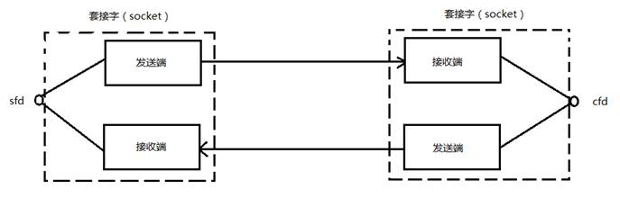
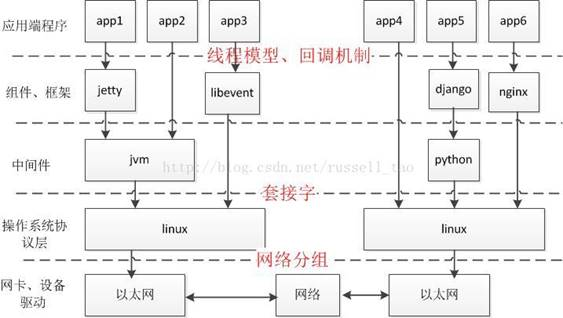

# 一、套接字相关概念

## 01 socket文件

Socket在Linux环境下，用于表示进程间网络通信的特殊文件类型，本质为内核借助缓冲区形成的伪文件，可使用文件描述符引用套接字，Linux系统将其封装成文件的目的是为了统一接口，使得读写套接字和读写文件的操作一致。

> 套接字与管道的区别在于：管道主要应用于本地进程间通信，而套接字多应用于网络进程间数据的传递。

## 02 套接字通讯原理

在TCP/IP协议中，使用 “IP地址+TCP或UDP端口号” 唯一标识网络通讯中的一个进程。“IP地址+端口号”  则对应一个socket。

> 建立连接的两个进程各自由一个socket来标识，双方socket组成的socket pair唯一标识一个连接。因此可以用Socket来描述网络连接的一对一关系。

  

在网络通信中，套接字成对出现：一端的发送缓冲区对应对端的接收缓冲区，使用同一个文件描述符可访问发送缓冲区和接收缓冲区。

​           

## 03 网络字节序

内存中的多字节数据相对于内存地址有大端和小端之分，磁盘文件中的多字节数据相对于文件中的偏移地址也有大端小端之分。网络数据流同样有大端小端之分：

1. 发送主机将发送缓冲区中的数据按内存地址从低到高的顺序发出。
2. 接收主机将从网络上接收到的字节依次保存在接收缓冲区（按内存地址从低到高顺序）

> 网络数据流规定：先发出的数据是低地址，后发出的数据是高地址。

**TCP/IP协议规定，网络数据流应采用大端字节序，即低地址高字节。**

以UDP段格式为例：地址0-1是16位的源端口号，端口号为1000（0x3e8）。

- 发送主机为大端字节序：地址0是0x03，地址1是0xe8，即先发0x03，再发0xe8，发送主机的缓冲区中低地址存0x03，高地址存0xe8。
- 发送主机为小端字节序：数据被解释成0xe803，而非1000。

> 如果主机是大端字节序的，发送和接收都不需要做转换。

**网络字节序和主机字节序的转换函数**

```c
#include <arpa/inet.h>
# 主机字节序==>网络字节序
uint32_t htonl(uint32_t hostlong);
uint16_t htons(uint16_t hostshort);
# 网络字节序==>主机字节序
uint32_t ntohl(uint32_t netlong);
uint16_t ntohs(uint16_t netshort);

# h表示host，n表示network，l表示32位长整数，s表示16位短整数。
# 主机是小端字节序：参数做相应的大小端转换然后返回。
# 主机是大端字节序：不做转换，将参数原样返回。
```

## 04 IP地址转换函数

```c
#include <arpa/inet.h>
# 将点分文本的IP地址转换为二进制网络字节序的IP地址
int inet_pton(int af, const char *src, void *dst);
# 将二进制网络字节序的IP地址转换为点分文本的IP地址
const char *inet_ntop(int af, const void *src, char *dst, socklen_t size);
```

 其中：af = AF_INET  或 AF_INET6。

## 05 sockaddr数据结构

​           

**struct sockaddr结构体**  

```c
struct sockaddr {
	sa_family_t sa_family; 		/* address family, AF_xxx */
	char sa_data[14];			/* 14 bytes of protocol address */
};
```

**struct sockaddr_in结构体**  

```c
# netinet/in.h
struct sockaddr_in {
	__kernel_sa_family_t sin_family; 			/* Address family */  	地址结构类型
	__be16 sin_port;					 		/* Port number */		端口号
	struct in_addr sin_addr;					/* Internet address */	IP地址
	/* Pad to size of `struct sockaddr'. */
	unsigned char __pad[__SOCK_SIZE__ - sizeof(short int) -
	sizeof(unsigned short int) - sizeof(struct in_addr)];
};

struct in_addr {						/* Internet address. */
	__be32 s_addr;
};
```

**struct sockaddr_in6结构体**  

```c
# netinet/in.h
struct sockaddr_in6 {
	unsigned short int sin6_family; 		/* AF_INET6 */
	__be16 sin6_port; 					/* Transport layer port # */
	__be32 sin6_flowinfo; 				/* IPv6 flow information */
	struct in6_addr sin6_addr;			/* IPv6 address */
	__u32 sin6_scope_id; 				/* scope id (new in RFC2553) */
};

struct in6_addr {
	union {
		__u8 u6_addr8[16];
		__be16 u6_addr16[8];
		__be32 u6_addr32[4];
	} in6_u;
	#define s6_addr 		in6_u.u6_addr8
	#define s6_addr16 		in6_u.u6_addr16
	#define s6_addr32	 	in6_u.u6_addr32
};
```

**sockaddr_un结构体**

```c
# sys/un.h
#define UNIX_PATH_MAX 108
	struct sockaddr_un {
	__kernel_sa_family_t sun_family; 	/* AF_UNIX */
	char sun_path[UNIX_PATH_MAX]; 	/* pathname */
};
```

IPv4、IPv6和Unix Domain Socket的地址类型分别定义为常数AF_INET、AF_INET6、AF_UNIX。只需获取某种sockaddr结构体的首地址，就可以确定结构体中的内容。因此，socket API 接受各种类型的sockaddr结构体指针做为参数，例如bind、accept、connect等函数。

> socket API函数的参数本应设计成void *类型以便接受各种类型的指针，但是sock API的实现早于ANSI C标准化，void *类型尚未出现，因此这些函数的参数都用struct sockaddr *类型表示，在传递参数之前要强制类型转换。

**使用**

```c
struct sockaddr_in servaddr;
bind(listen_fd, (struct sockaddr *)&servaddr, sizeof(servaddr));
```

# 二、网络套接字函数

## 01 SOCKET模型创建流程图

​           

## 02 socket函数

函数功能：获取套接字。

函数原型：

```c
#include <sys/socket.h>
int socket(int domain, int type, int protocol);
```

函数参数：

- domain：
  - AF_INET：IPv4地址。
  - AF_INET6：IPv6地址。
  - AF_UNIX：本地协议，客户端与服务端在同一台主机上。

- type：
  - SOCK_STREAM：基于字节流的TCP连接。
  - SOCK_DGRAM：基于数据报的UDP连接。
  - SOCK_SEQPACKET：双线路的可靠连接，发送固定长度的数据包进行传输。完整接受后才能进行读取。
  - SOCK_RAW：socket类型提供单一的网络访问，使用ICMP公共协议（ping、traceroute）。
  - SOCK_RDM：供数据链路层使用，不保证数据包的顺序。

- protocol：0，表示使用默认协议。

返回值：

- 成功：返回指向新创建的socket的文件描述符。
- 失败：-1，设置errno。

## 03 bind函数

函数功能：为套接字绑定网络地址和端口号。

函数原型：

```c
#include <sys/socket.h>
int bind(int socket, const struct sockaddr *address, socklen_t address_len);
```

函数参数：

- socket：socket文件描述符。
- address：IP地址+端口号。
- address_len：sizeof(address)长度。

**使用**

```c
struct sockaddr_in servaddr;
# 1.清空 sockaddr_in 结构体
bzero(&servaddr, sizeof(servaddr));
# 2.设置地址类型：IPv4
servaddr.sin_family = AF_INET;
# 3.主机字节序转网络字节序（INADDR_ANY：监听本机所有IP）
servaddr.sin_addr.s_addr = htonl(INADDR_ANY);
# 4.设置端口号：6666
servaddr.sin_port = htons(6666);
```

## 04 listen函数

函数功能：监听客户端的连接请求。

函数原型：

```c
#include <sys/socket.h>
int listen(int socket, int backlog);
```

函数参数：backlog，排队建立3次握手队列和刚刚建立3次握手队列的连接总和，默认1024。

函数说明：服务器处理不及时，尚未accept的客户端处于连接等待状态，最多允许有backlog个客户端处于连接待状态，如果接收到更多的连接请求就忽略。

> 查看系统默认backlog：cat /proc/sys/net/ipv4/tcp_max_syn_backlog

## 05 accept函数

函数功能：三次握手结束后，接受客户端连接。

函数原型：

```c
#include <sys/socket.h>
int accept(int socket, struct sockaddr *restrict address,
           socklen_t *restrict address_len);
```

函数参数：

- address：传出参数，返回连接客户端地址信息，含IP地址和端口号。
- address_len：传入传出参数，传入sizeof(addr)大小，返回真正接收到地址结构体的大小。

返回值：

- 成功：新的socket文件描述符，用于与客户端通信。
- 失败：-1，设置errno。

**使用**

```c
// 循环处理客户端连接
while (1) {
	cliaddr_len = sizeof(cliaddr);
	connfd = accept(listenfd, (struct sockaddr *)&cliaddr, &cliaddr_len);
	n = read(connfd, buf, MAXLINE);
	......
	close(connfd);
}
```

## 06 connect函数

函数功能：客户端连接服务器。

函数原型：

```c
#include <sys/socket.h>
int connect(int socket, const struct sockaddr *address, socklen_t address_len);
```

函数参数：

- address：传入参数，指定服务器端地址信息，含IP地址和端口号。
- addrlen：传入参数，传入sizeof(address)大小。

# 三、C/S模型—TCP

基于TCP协议的客户端/服务器程序的一般流程：

​           

## 01 服务端

```c
// 从客户端读字符，转换为大写后回送到客户端。
#include <stdio.h>
#include <stdlib.h>
#include <string.h>
#include <sys/types.h>
#include <unistd.h>
#include <arpa/inet.h>
#include <netinet/in.h>
#include <ctype.h>

int main()
{
    int listen_fd = socket(AF_INET, SOCK_STREAM, 0);
    if (listen_fd < 0)
    {
        perror("socket error");
        return -1;
    }

    struct sockaddr_in server;
    bzero(&server, sizeof(server));
    server.sin_family = AF_INET;
    server.sin_port = htons(8888);
    server.sin_addr.s_addr = htonl(INADDR_ANY);
    socklen_t server_len = sizeof(server);
    int ret = bind(listen_fd, (struct sockaddr *)&server, server_len);
    if (ret < 0)
    {
        perror("bind error");
        return -1;
    }
    
    listen(listen_fd, 128);

    struct sockaddr_in client;
    socklen_t client_len = sizeof(client);
    int connect_fd = accept(listen_fd, (struct sockaddr *)&client, &client_len);
    if (connect_fd < 0)
    {
        perror("accept error");
        return -1;
    }

    char client_ip[16];
    memset(client_ip, 0x00, sizeof(client_ip));
    printf("CLIENT %s:%d CONNECTED!\n", inet_ntop(AF_INET, &client.sin_addr.s_addr, client_ip, sizeof(client_ip)), ntohs(client.sin_port));

    int i = 0;
    int n = 0;
    char buf[1024];

    while (1)
    {
        memset(buf, 0x00, sizeof(buf));
        n = read(connect_fd, buf, sizeof(buf));
        if (n <= 0)
        {
            printf("CLIENT %s:%d DISCONNECTED!\n", inet_ntop(AF_INET, &client.sin_addr.s_addr, client_ip, sizeof(client_ip)), ntohs(client.sin_port));
            break;
        }
        printf("RECEIVED DATA FROM %s:%d:%s\n", inet_ntop(AF_INET, &client.sin_addr.s_addr, client_ip, sizeof(client_ip)), ntohs(client.sin_port), buf);
        for (i = 0; i < n; i++)
        {
            buf[i] = toupper(buf[i]);
        }
        write(connect_fd, buf, n);
        printf("SEND DATA TO %s:%d:%s\n", inet_ntop(AF_INET, &client.sin_addr.s_addr, client_ip, sizeof(client_ip)), ntohs(client.sin_port), buf);
    }

    close(connect_fd);
    close(listen_fd);

    return 0;
}
```

## 02 客户端

```c
// 向客户端发送字符，并接受转换结果。
#include <stdio.h>
#include <stdlib.h>
#include <string.h>
#include <sys/types.h>
#include <unistd.h>
#include <arpa/inet.h>
#include <netinet/in.h>
#include <ctype.h>

int main()
{
    int connect_fd = socket(AF_INET, SOCK_STREAM, 0);
    if (connect_fd < 0)
    {
        perror("socket error");
        return -1;
    }

    struct sockaddr_in server;
    bzero(&server, sizeof(server));
    server.sin_family = AF_INET;
    server.sin_port = htons(8888);
    inet_pton(AF_INET, "127.0.0.1", &server.sin_addr.s_addr);
    socklen_t server_len = sizeof(server);
    int ret = connect(connect_fd, (struct sockaddr *)&server, server_len);
    if (ret < 0)
    {
        perror("connect error");
        return -1;
    }
    char server_ip[INET_ADDRSTRLEN];
    memset(server_ip, 0x00, sizeof(server_ip));
    printf("SERVER %s:%d CONNECTED!\n", inet_ntop(AF_INET, &server.sin_addr.s_addr, server_ip, sizeof(server_ip)), ntohs(server.sin_port));

    int n = 0;
    char buf[256];

    while (1)
    {
        memset(buf, 0x00, sizeof(buf));
        n = read(STDIN_FILENO, buf, sizeof(buf));

        write(connect_fd, buf, n-1);
        
        memset(buf, 0x00, sizeof(buf));
        n = read(connect_fd, buf, sizeof(buf));
        if (n <= 0)
        {
            printf("SERVER %s:%d CLOSED!\n", inet_ntop(AF_INET, &server.sin_addr.s_addr, server_ip, sizeof(server_ip)), ntohs(server.sin_port));
            break;
        }
        printf("RECEIVED DATA FROM %s:%d:%s\n", inet_ntop(AF_INET, &server.sin_addr.s_addr, server_ip, sizeof(server_ip)), ntohs(server.sin_port), buf);
    }

    close(connect_fd);

    return 0;
}
```

# 四、出错处理封装函数

对socket相关的系统函数加上错误处理代码包装成新的函数。

**头文件：**

```c
#ifndef __WRAP_H_
#define __WRAP_H_ 

#include <stdio.h>
#include <stdlib.h>
#include <string.h>
#include <strings.h>
#include <unistd.h>
#include <errno.h>
#include <arpa/inet.h>
#include <sys/socket.h>

void perr_exit(const char *s);
int Socket(int family, int type, int protocol);
int Bind(int fd, const struct sockaddr *sa, socklen_t salen);
int Listen(int fd, int backlog);
int Accept(int fd, struct sockaddr *sa, socklen_t *salenptr);
int Connect(int fd, struct sockaddr *sa, socklen_t salen);
int Close(int fd);

ssize_t Read(int fd, void *ptr, size_t nbytes);
ssize_t Write(int fd, const void *ptr, size_t nbytes);
ssize_t Readn(int fd, void *vptr, size_t n);
ssize_t Writen(int fd, const void *vptr, size_t n);
static ssize_t my_read(int fd, char *ptr);
ssize_t Readline(int fd, void *vptr, size_t maxlen);
int tcp4bind(short port,const char *IP);

#endif // !__WRAP_H_
```

**源文件：**

```c
#include "wrap.h"

void perr_exit(const char *s)
{
    perror(s);
    exit(-1);
}

int Socket(int family, int type, int protocol)
{
    int fd;
    if ((fd = socket(family, type, protocol)) < 0)
        perr_exit("socket error");
    return fd;
}

int Bind(int fd, const struct sockaddr *sa, socklen_t salen)
{
    int n;
	if ((n = bind(fd, sa, salen)) < 0)
		perr_exit("bind error");
    return n;
}

int Listen(int fd, int backlog)
{
    int n;
    if ((n == listen(fd, backlog)) < 0)
        perr_exit("listen error");
    return n;
}

int Accept(int fd, struct sockaddr *sa, socklen_t *salenptr)
{
    int connect_fd;

    while (1)
    {
        if ((connect_fd = accept(fd, sa, salenptr)) < 0) {
		    if ((errno == ECONNABORTED) || (errno == EINTR))
                continue;
		    else
			    perr_exit("accept error");
	    }
        return connect_fd;
    }
}

int Connect(int fd, struct sockaddr *sa, socklen_t salen)
{
    int n;
    if ((n = connect(fd, sa, salen)) < 0)
        perr_exit("connect error");
    return n;
}

int Close(int fd)
{
    close(fd);
}

ssize_t Read(int fd, void *ptr, size_t nbytes)
{
    ssize_t n;
    while (1)
    {
        if ((n = read(fd, ptr, nbytes)) == -1)
        {
            if (errno == EINTR)
                continue;
            else
                return -1;
        }
        return n;
    }
}

ssize_t Write(int fd, const void *ptr, size_t nbytes)
{
    ssize_t n;
    while (1)
    {
        if ((n = write(fd, ptr, nbytes)) == -1)
        {
            if (errno == EINTR)
                continue;
            else
                return -1;
        }
        return n;
    }
}

ssize_t Readn(int fd, void *vptr, size_t n)
{
    ssize_t nleft;
    ssize_t nread;
    char *ptr;

    ptr = vptr;
    nleft = n;

    while (nleft > 0)
    {
        if ((nread = read(fd, ptr, nleft)) < 0)
        {
            if (errno == EINTR)
                nread = 0;
            else
                return -1;
        }
        else if (nread == 0)
            break;
        nleft -= nread;
        ptr += nread;
    }
    return n - nleft;
}

ssize_t Writen(int fd, const void *vptr, size_t n)
{
    ssize_t nleft;
    ssize_t nwritten;
    const char *ptr;

    ptr = vptr;
    nleft = n;

    while (nleft > 0)
    {
        if ((nwritten = write(fd, ptr, nleft)) <= 0)
        {
            if (nwritten < 0 && errno == EINTR)
                nwritten = 0;
            else
                return -1;
        }
        nleft -= nwritten;
        ptr += nwritten;
    }
    return n;
}

static ssize_t my_read(int fd, char *ptr)
{
	static int read_cnt;
	static char *read_ptr;
	static char read_buf[100];

	if (read_cnt <= 0) {
again:
		if ( (read_cnt = read(fd, read_buf, sizeof(read_buf))) < 0) {
			if (errno == EINTR)
				goto again;
			return -1;
		} else if (read_cnt == 0)
			return 0;
		read_ptr = read_buf;
	}
	read_cnt--;
	*ptr = *read_ptr++;

	return 1;
}

ssize_t Readline(int fd, void *vptr, size_t maxlen)
{
	ssize_t n, rc;
	char    c, *ptr;

	ptr = vptr;
	for (n = 1; n < maxlen; n++) {
		if ( (rc = my_read(fd, &c)) == 1) {
			*ptr++ = c;
			if (c  == '\n')
				break;
		} else if (rc == 0) {
			*ptr = 0;
			return n - 1;
		} else
			return -1;
	}
	*ptr  = 0;

	return n;
}

int tcp4bind(short port,const char *IP)
{
    struct sockaddr_in serv_addr;
    int lfd = Socket(AF_INET,SOCK_STREAM,0);
    bzero(&serv_addr,sizeof(serv_addr));
    if(IP == NULL){
        serv_addr.sin_addr.s_addr = INADDR_ANY;
    }else{
        if(inet_pton(AF_INET,IP,&serv_addr.sin_addr.s_addr) <= 0){
            perror(IP);
            exit(1);
        }
    }
    serv_addr.sin_family = AF_INET;
    serv_addr.sin_port   = htons(port);
    Bind(lfd,(struct sockaddr *)&serv_addr,sizeof(serv_addr));
    return lfd;
}
```

# 五、高并发服务器

​           

## 01 多进程并发服务器

注：

1. 父进程最大文件描述个数(父进程中需要close关闭accept返回的新文件描述符)  。
2. 系统内创建进程个数（与内存大小相关）。
3. 进程创建过多是否影响整体服务性能（进程调度）。

**SERVER**

```c
#include "../WRAP/wrap.h"

int main()
{
    int listen_fd = Socket(AF_INET, SOCK_STREAM, 0);
    
    struct sockaddr_in server;
    bzero(&server, sizeof(server));
    server.sin_family = AF_INET;
    server.sin_port = htons(8888);
    server.sin_addr.s_addr = htonl(INADDR_ANY);
    socklen_t server_len = sizeof(server);

    Bind(listen_fd, (struct sockaddr *)&server, server_len);

    Listen(listen_fd, 1024);

    pid_t pid;
    int connect_fd;
    struct sockaddr_in client;
    bzero(&client, sizeof(client));
    socklen_t client_len = sizeof(client);

    while (1)
    {
        connect_fd = Accept(listen_fd, (struct sockaddr *)&client, &(client_len));
        char client_ip[INET_ADDRSTRLEN];
        memset(client_ip, 0x00, sizeof(client_ip));
        printf("CLIENT %s:%d CONNECTED!\n", inet_ntop(AF_INET, &client.sin_addr.s_addr, client_ip, sizeof(client_ip)), ntohs(client.sin_port));

        pid = fork();
        if (pid < 0)
        {
            perr_exit("fork error");
        }
        else if (pid > 0)
        {
            Close(connect_fd);
        }
        else if (pid == 0)
        {
            Close(listen_fd);

            int i=0;
			int n;
			char buf[1024];
			
			while(1)
			{
                memset(buf, 0x00, sizeof(buf));
				n = Read(connect_fd, buf, sizeof(buf));
				if(n<=0)
				{
                    printf("CLIENT %s:%d DISCONNECTED!\n", inet_ntop(AF_INET, &client.sin_addr.s_addr, client_ip, sizeof(client_ip)), ntohs(client.sin_port));
					break;
				}
				printf("RECV %s:%d:%s\n", inet_ntop(AF_INET, &client.sin_addr.s_addr, client_ip, sizeof(client_ip)), ntohs(client.sin_port), buf);
				
				for(i=0; i<n; i++)
				{
					buf[i] = toupper(buf[i]);
				}
				Write(connect_fd, buf, n);
                printf("SEND %s:%d:%s\n", inet_ntop(AF_INET, &client.sin_addr.s_addr, client_ip, sizeof(client_ip)), ntohs(client.sin_port), buf);
			}
            Close(connect_fd);
            exit(0);
        }
    }

    Close(listen_fd);
    
    return 0;
}
```

**CLIENT**

```c
#include "../WRAP/wrap.h"

int main()
{
    int connect_fd = Socket(AF_INET, SOCK_STREAM, 0);
    
    struct sockaddr_in server;
    bzero(&server, sizeof(server));
    server.sin_family = AF_INET;
    server.sin_port = htons(8888);
    inet_pton(AF_INET, "127.0.0.1", &server.sin_addr.s_addr);
    socklen_t server_len = sizeof(server);

    Connect(connect_fd, (struct sockaddr *)&server, server_len);

    char server_ip[INET_ADDRSTRLEN];
    memset(server_ip, 0x00, sizeof(server_ip));
    printf("SERVER %s:%d CONNECTED!\n", inet_ntop(AF_INET, &server.sin_addr.s_addr, server_ip, sizeof(server_ip)), ntohs(server.sin_port));

    int n = 0;
    char buf[256];
    while (1)
    {
        memset(buf, 0x00, sizeof(buf));
        n = Read(STDIN_FILENO, buf, sizeof(buf));

        Write(connect_fd, buf, n-1);
        
        memset(buf, 0x00, sizeof(buf));
        n = Read(connect_fd, buf, sizeof(buf));
        if (n <= 0)
        {
            printf("SERVER %s:%d CLOSED!\n", inet_ntop(AF_INET, &server.sin_addr.s_addr, server_ip, sizeof(server_ip)), ntohs(server.sin_port));
            break;
        }
        printf("RECV %s:%d:%s\n", inet_ntop(AF_INET, &server.sin_addr.s_addr, server_ip, sizeof(server_ip)), ntohs(server.sin_port), buf);
    }

    Close(connect_fd);

    return 0;
}
```

## 02 多线程并发服务器

注：

1. 调整进程内最大文件描述符上限。
2. 线程间共享数据时，进行线程同步。
3. 服务端、客户端退出时，做退出处理（退出值，分离态）。
4. 系统负载，随连接客户端增多，导致其它线程不能及时得到CPU。

**SERVER**

```c
#include <stdio.h>
#include <string.h>
#include <netinet/in.h>
#include <arpa/inet.h>
#include <pthread.h>

#include "../WRAP/wrap.h"

#define MAXLINE 90
#define SERV_PORT 8888

struct s_info
{
    struct sockaddr_in client_addr;
    int fd;
};

void *do_work(void *args)
{
    int n,i;
    struct s_info *ts = (struct s_info*)args;
    char buf[MAXLINE];
    char str[INET_ADDRSTRLEN];

    pthread_detach(pthread_self());

    char client_ip[INET_ADDRSTRLEN];
    memset(client_ip, 0x00, sizeof(client_ip));
    printf("CLIENT %s:%d CONNECTED!\n", inet_ntop(AF_INET, &(*ts).client_addr.sin_addr.s_addr, client_ip, sizeof(client_ip)), ntohs((*ts).client_addr.sin_port));

    while (1)
    {
        memset(buf, 0x00, sizeof(buf));
        n = Read(ts->fd, buf, MAXLINE);
        if (n <= 0)
        {
            printf("CLIENT %s:%d DISCONNECTED!\n", inet_ntop(AF_INET, &(*ts).client_addr.sin_addr.s_addr, client_ip, sizeof(client_ip)), ntohs((*ts).client_addr.sin_port));
            break;
        }
        printf("RECV %s:%d:%s\n", inet_ntop(AF_INET, &(*ts).client_addr.sin_addr, str, sizeof(str)), ntohs((*ts).client_addr.sin_port), buf);
        for (i = 0; i < n; i++)
        {
            buf[i] = toupper(buf[i]);
        }
        Write(ts->fd, buf, n);
        printf("SEND %s:%d:%s\n", inet_ntop(AF_INET, &(*ts).client_addr.sin_addr.s_addr, client_ip, sizeof(client_ip)), ntohs((*ts).client_addr.sin_port), buf);
    }
    Close(ts->fd);
}

int main()
{
    pthread_t tid;
    int i = 0;
    struct s_info ts[256];

    int listen_fd, connect_fd;
    struct sockaddr_in server_addr, client_addr;

    bzero(&server_addr, sizeof(server_addr));
    server_addr.sin_family = AF_INET;
    server_addr.sin_addr.s_addr = htonl(INADDR_ANY);
    server_addr.sin_port = htons(SERV_PORT);

    socklen_t client_len;

    listen_fd = Socket(AF_INET, SOCK_STREAM, 0);
    Bind(listen_fd, (struct sockaddr*)&server_addr, sizeof(server_addr));
    Listen(listen_fd, 20);

    while (1)
    {
        client_len = sizeof(client_addr);
        connect_fd = Accept(listen_fd, (struct sockaddr*)&client_addr, &client_len);
        ts[i].client_addr = client_addr;
        ts[i].fd = connect_fd;

        pthread_create(&tid, NULL, do_work, (void*)&ts[i]);
        i++;
    }
    return 0;
}
```

**CLIENT**

```c
#include <stdio.h>
#include <string.h>
#include <netinet/in.h>
#include <arpa/inet.h>
#include <pthread.h>

#include "../WRAP/wrap.h"

#define MAXLINE 90
#define SERV_PORT 8888

int main()
{   
    struct sockaddr_in server_addr;
    char buf[MAXLINE];
    int fd, n;

    fd = Socket(AF_INET, SOCK_STREAM, 0);
    bzero(&server_addr, sizeof(server_addr));
    server_addr.sin_family = AF_INET;
    inet_pton(AF_INET, "127.0.0.1", &server_addr.sin_addr);
    server_addr.sin_port = htons(SERV_PORT);

	Connect(fd, (struct sockaddr *)&server_addr, sizeof(server_addr));

    char server_ip[INET_ADDRSTRLEN];
    memset(server_ip, 0x00, sizeof(server_ip));
    printf("SERVER %s:%d CONNECTED!\n", inet_ntop(AF_INET, &server_addr.sin_addr.s_addr, server_ip, sizeof(server_ip)), ntohs(server_addr.sin_port));

    while (1)
    {
        memset(buf, 0x00, sizeof(buf));
        n = Read(STDIN_FILENO, buf, sizeof(buf));

        Write(fd, buf, n-1);
        
        memset(buf, 0x00, sizeof(buf));
        n = Read(fd, buf, sizeof(buf));
        if (n <= 0)
        {
            printf("SERVER %s:%d CLOSED!\n", inet_ntop(AF_INET, &server_addr.sin_addr.s_addr, server_ip, sizeof(server_ip)), ntohs(server_addr.sin_port));
            break;
        }
        printf("RECV %s:%d:%s\n", inet_ntop(AF_INET, &server_addr.sin_addr.s_addr, server_ip, sizeof(server_ip)), ntohs(server_addr.sin_port), buf);
    }
	Close(fd);
    return 0;
}
```

## 03 select

**select的缺点**

1. select会修改传入的参数数组（每次循环时需要重新设置）
2. select监控是否有sock出现数据，但只返回，需要客户自行判断（轮询，影响效率）。
3. select可监听的文件描述符个数受限于FD_SETSIZE，一般为1024。
4. select不是线程安全的。

**select函数**

函数原型：

```c
#include <sys/select.h>

int pselect(int nfds, fd_set *restrict readfds,
            fd_set *restrict writefds, fd_set *restrict errorfds,
            const struct timespec *restrict timeout,
            const sigset_t *restrict sigmask);

int select(int nfds, fd_set *restrict readfds,
           fd_set *restrict writefds, fd_set *restrict errorfds,
           struct timeval *restrict timeout);

void FD_CLR(int fd, fd_set *fdset);		// 从文件描述符集合中删除一个文件描述符。
int FD_ISSET(int fd, fd_set *fdset);	// 判断指定的文件描述符是否在该集合中。
void FD_SET(int fd, fd_set *fdset);		// 向文件描述符集合中增加一个新的文件描述符。
void FD_ZERO(fd_set *fdset);			// 将指定的文件描述符集清空。
```

函数参数：

- nfds：监听的所有文件描述符中的最大描述符+1 。
- readfds：读文件描述符监听集合，传入传出参数。
- writefds：写文件描述符监听集合，传入传出参数。
- errorfds：异常文件描述符监听集合，传入传出参数。
- timeout：阻塞监听时间。
  - NULL：阻塞监听。
  - 大于0：设置监听超时时长。
  - 0：非阻塞监听。

函数返回值：

- 大于0：所有监听集合中，满足对应事件的文件描述符的总数。
- 0：无满足条件的文件描述符。
- -1：出错error。

**timeval结构体**

```c
#include <sys/time.h>
#include <sys/types.h>
#include <unistd.h>

struct timeval {
    long tv_sec; /* seconds */
    long tv_usec; /* microseconds */
};
```

**SERVER**

```c
#include <stdio.h>
#include <stdlib.h>
#include <string.h>
#include <netinet/in.h>
#include <arpa/inet.h>

#include <sys/select.h>
#include <sys/time.h>
#include <sys/types.h>
#include <unistd.h>

#include "../WRAP/wrap.h"

#define MAXLINE 256
#define SERV_PORT 8888

int main()
{
    int i, maxi, maxfd, sock_fd, listen_fd, connect_fd;
    int nready;
    int client[FD_SETSIZE]; // FD_SETSIZE 默认为 1024
    
    ssize_t n;

    fd_set rset;
    fd_set allset;

    char buf[MAXLINE];
    char client_ip[INET_ADDRSTRLEN]; // #define INET_ADDRSTRLEN 16
    socklen_t client_len;
    struct sockaddr_in client_addr, server_addr;

    listen_fd = Socket(AF_INET, SOCK_STREAM, 0);

    bzero(&client_addr, sizeof(client_addr));
    bzero(&server_addr, sizeof(server_addr));
    server_addr.sin_family = AF_INET;
    server_addr.sin_addr.s_addr = htonl(INADDR_ANY);
    server_addr.sin_port = htons(SERV_PORT);

    Bind(listen_fd, (struct sockaddr *)&server_addr, sizeof(server_addr));
    // listen()的参数backlog：未完成队列与已完成队列和的最大值，默认最大为128。
    Listen(listen_fd, 20);

    maxfd = listen_fd;  // 初始化
    maxi = -1; // client[]的下标

    for (i = 0; i < FD_SETSIZE; i++)
    {
        client[i] = -1; // 使用-1初始化client[]
    }
    FD_ZERO(&allset);
    FD_SET(listen_fd, &allset); // 构造select监控文件描述符集

    while (1)
    {
        rset = allset; // 每次循环时重新设置select监控集合
        nready = select(maxfd+1, &rset, NULL, NULL, NULL);

        if (nready < 0)
            perr_exit("select error");
        if (FD_ISSET(listen_fd, &rset))
        {
            client_len = sizeof(client_addr);
            connect_fd = Accept(listen_fd, (struct sockaddr *)&client_addr, &client_len);
            printf("CLIENT %s:%d CONNECTED!\n", inet_ntop(AF_INET, &client_addr.sin_addr.s_addr, client_ip, sizeof(client_ip)), ntohs(client_addr.sin_port));
            for (i = 0; i < FD_SETSIZE; i++)
            {
                if (client[i] < 0)
                {
                    client[i] = connect_fd; // 保存accept返回的文件描述符到client[]中
                    break;
                }
            }
            // 达到select可监控的文件描述符个数上限1024
            if (i == FD_SETSIZE)
            {
                fputs("NOT CONNNECTABLE!\n", stderr);
                exit(1);
            }
            FD_SET(connect_fd, &allset); // 添加新的文件描述符到监控集合中
            if (connect_fd > maxfd)
                maxfd = connect_fd; // 更新maxfd，select函数需要
            if (i > maxi)
                maxi = i; // 更新client[]最大下标值
            if (--nready == 0)
                continue; // 如果未监听到就绪文件描述符则返回继续阻塞监听，否则处理未处理完的就绪文件描述符	    
        }

        for (i = 0; i <= maxi; i++) { // 遍历已连接套接字（轮询）
			if ( (sock_fd = client[i]) < 0)
				continue;
			if (FD_ISSET(sock_fd, &rset)) { // 判断该文件描述符是否就绪
                memset(&buf, 0x00, sizeof(buf));
                memset(&client_ip, 0x00, sizeof(client_ip));
				if ( (n = Read(sock_fd, buf, MAXLINE)) == 0) 
                {
					Close(sock_fd); // Client关闭连接时，服务端也关闭对应连接。
					FD_CLR(sock_fd, &allset); // 解除对该文件描述符的监听。
					client[i] = -1;
				} 
                else 
                {
                    printf("RECV:%s\n", buf);
                    
					int j;
					for (j = 0; j < n; j++)
						buf[j] = toupper(buf[j]);
					Write(sock_fd, buf, n);
                    printf("SEND:%s\n", buf);
                    memset(&buf, 0x00, sizeof(buf));
                    memset(&client_ip, 0x00, sizeof(client_ip));
				}
				if (--nready == 0)
					break;
			}
		}
    }
    
    close(listen_fd);
	return 0;
}
```

**CLIENT**

```c
#include <stdio.h>
#include <stdlib.h>
#include <string.h>
#include <netinet/in.h>
#include <arpa/inet.h>

#include <sys/select.h>
#include <sys/time.h>
#include <sys/types.h>
#include <unistd.h>

#include "../WRAP/wrap.h"

#define MAXLINE 256
#define SERV_PORT 8888

int main()
{
    int connect_fd = Socket(AF_INET, SOCK_STREAM, 0);
    
    struct sockaddr_in server_addr;
    bzero(&server_addr, sizeof(server_addr));
    server_addr.sin_family = AF_INET;
    server_addr.sin_port = htons(SERV_PORT);
    inet_pton(AF_INET, "127.0.0.1", &server_addr.sin_addr.s_addr);
    socklen_t server_len = sizeof(server_addr);

    Connect(connect_fd, (struct sockaddr *)&server_addr, server_len);

    char server_ip[INET_ADDRSTRLEN];
    memset(server_ip, 0x00, sizeof(server_ip));
    printf("SERVER %s:%d CONNECTED!\n", inet_ntop(AF_INET, &server_addr.sin_addr.s_addr, server_ip, sizeof(server_ip)), ntohs(server_addr.sin_port));

    int n = 0;
    char buf[MAXLINE];
    while (1)
    {
        memset(buf, 0x00, sizeof(buf));
        n = Read(STDIN_FILENO, buf, sizeof(buf));

        Write(connect_fd, buf, n-1);
        
        memset(buf, 0x00, sizeof(buf));
        n = Read(connect_fd, buf, sizeof(buf));
        if (n <= 0)
        {
            printf("SERVER %s:%d CLOSED!\n", inet_ntop(AF_INET, &server_addr.sin_addr.s_addr, server_ip, sizeof(server_ip)), ntohs(server_addr.sin_port));
            break;
        }
        printf("RECV %s:%d:%s\n", inet_ntop(AF_INET, &server_addr.sin_addr.s_addr, server_ip, sizeof(server_ip)), ntohs(server_addr.sin_port), buf);
    }

    Close(connect_fd);

    return 0;
}
```

## 04 poll

**poll特点**

1. 在select的基础上，去除了FD_SETSIZE（连接个数1024）限制。
2. 不再修改传入数组（具体视平台而定）。
3. 只能在一个线程内处理I/O流。

## 05 epoll

**epoll特点**

1. 线程安全。
2. 无需遍历整个被侦听描述符集，只需遍历被内核IO事件异步唤醒而加入Ready的队列即可。
3. 不仅提供水平触发，还提供边沿触发。
4. 只支持linux。

**修改socket描述符上限**

使用cat命令查看一个进程可打开的文件描述符上限。

```bash
cat /proc/sys/fs/file-max
# 175665
```

通过修改配置文件更改socket描述符上限值。

```c
sudo vi /etc/security/limits.conf
# 在文件尾部写入以下配置,soft软限制，hard硬限制。如下图所示。
* soft nofile 65536
* hard nofile 100000
```

**基础API**

1. 创建epoll句柄

   ```c
   #include <sys/epoll.h>
   int epoll_create(int size)		
   /*
   	size：监听数目（内核参考值）
   	返回值：
       	成功：非负文件描述符。
       	失败：-1，设置相应的errno。
   */
   ```

2. 控制某个epoll监控的文件描述符上的事件：注册、修改、删除。

   ```c
   #include <sys/epoll.h>
   int epoll_ctl(int epfd, int op, int fd, struct epoll_event *event);
   /*
       epfd：epoll_creat创建的句柄。
       op：要执行的动作，用3个宏来表示：
       	EPOLL_CTL_ADD (注册新的fd到epfd)，
       	EPOLL_CTL_MOD (修改已经注册的fd的监听事件)，
       	EPOLL_CTL_DEL (从epfd删除一个fd)；
       event：告知内核需要监听的事件。
   */
   struct epoll_event {
   	__uint32_t events; /* Epoll events */
   	epoll_data_t data; /* User data variable */
   };
   
   typedef union epoll_data {
       void *ptr;
       int fd;
       uint32_t u32;
       uint64_t u64;
   } epoll_data_t;
   /*
       EPOLLIN：表示对应的文件描述符可以读（包括对端SOCKET正常关闭）
           EPOLLOUT：	表示对应的文件描述符可以写
           EPOLLPRI：	表示对应的文件描述符有紧急的数据可读（这里应该表示有带外数据到来）
           EPOLLERR：	表示对应的文件描述符发生错误
           EPOLLHUP：	表示对应的文件描述符被挂断；
           EPOLLET： 	将EPOLL设为边缘触发(Edge Triggered)模式，相对于水平触发(Level Triggered)
           EPOLLONESHOT：只监听一次事件，监听完毕后如需再次监听需要重新将该socket加入到EPOLL队列。
       返回值：
       	成功：0。
       	失败：-1，设置相应的errno。
   */
   ```

3. 等待所监控文件描述符上的事件产生。

   ```c
   #include <sys/epoll.h>
   int epoll_wait(int epfd, struct epoll_event *events, int maxevents, int timeout);
   /*
   	events：事件集合。
   	maxevents：events大小，不能大于创建epoll_create()时的监听数目size。
   	timeout：超时时间
   		-1：	阻塞监听
   		0：	非阻塞，立即返回
   		>0：	监听超时时间（毫秒）
   返回值：
   	成功：返回已就绪文件描述符个数。
   	超时：返回0。
   	出错：返回-1。
   */
   ```

**SERVER**

```c

```


**CLIENT**

```c

```


